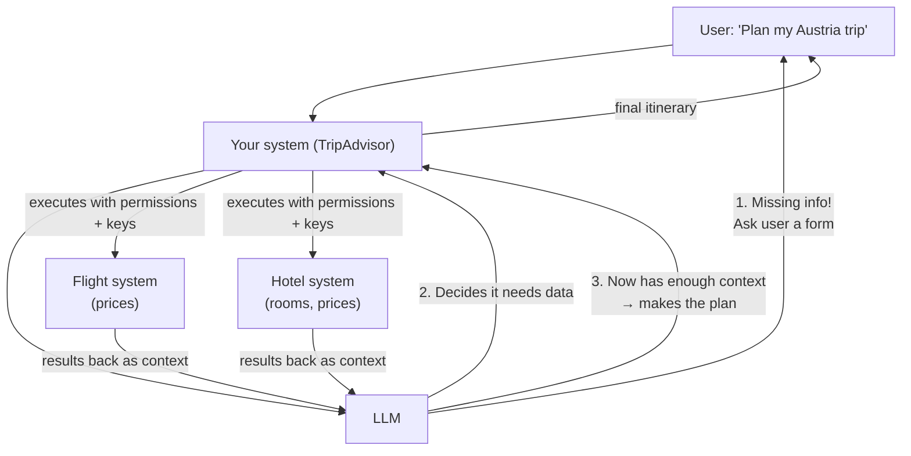
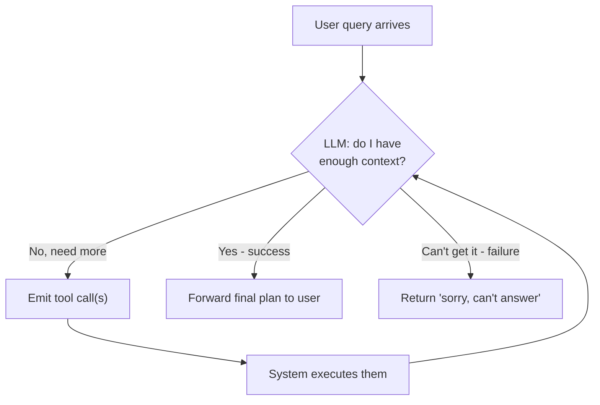
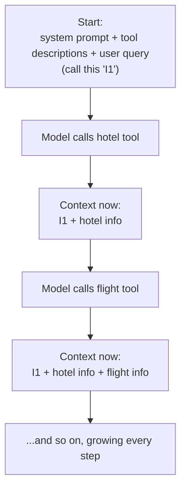
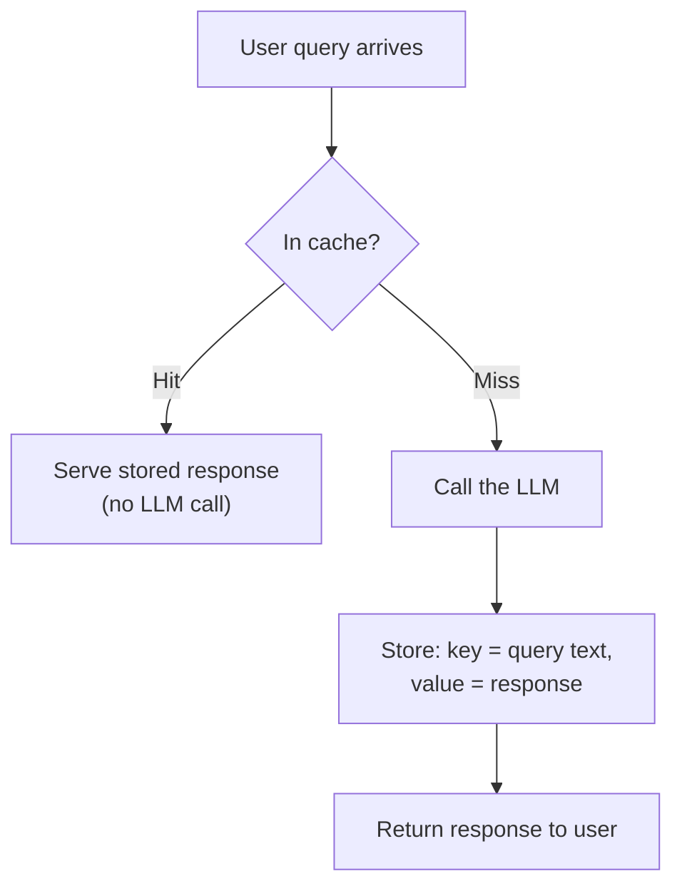
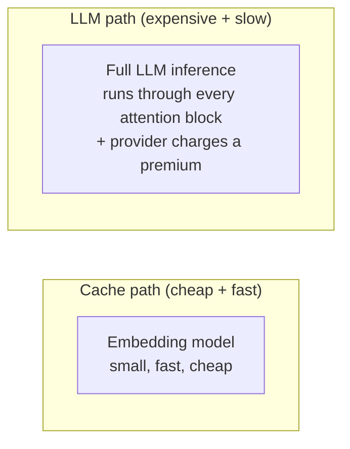
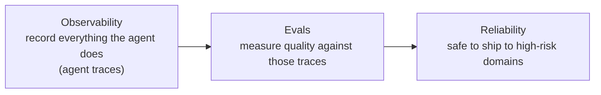
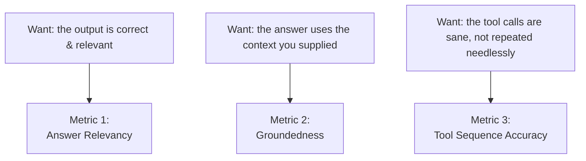
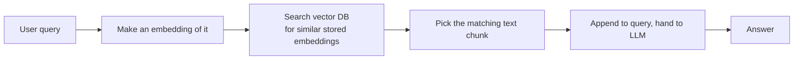
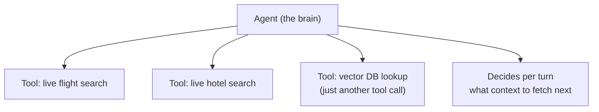

# AI Interview Question: LLMs vs. Agents — Explained Simply

**YouTube video:** https://www.youtube.com/watch?v=d-98DZZrS7M
**Channel:** Gaurav Sen (GKCS)

What's the difference between an LLM and an agent?" — and keeps pressing until the full architecture of an agent is drawn out.

## The One-Line Answer (the entry ticket, not the full answer)

- An **agent** can **perform actions** — it can trigger calls to external systems or your own internal ones.
- An **LLM** on its own **cannot** — it only produces text.

## The Running Example: A Trip Planner

A user says: _"I'm going to Austria, please plan a trip itinerary."_ That request reaches your system (called "TripAdvisor" in the example). The naive design is: your system just forwards this to an LLM and asks it to make the plan.

**The problem:** that request is almost empty. From "I'm going to Austria," the system knows nothing about _who this person is_ — are they travelling with family? What are their flight preferences? Hotel budget? Dates?

**This is the key insight:** a plain LLM call doesn't fail because the model can't write a good itinerary — it absolutely can. It fails because **the information needed to make good decisions isn't in the request at all.** What turns an LLM into an agent is a _mechanism for going and getting the information that's missing._

## How an Agent Fills the Gaps

Two ways the agent gathers what it's missing:

1. **Counter-question the user.** The first "action" isn't even an external API call — it's the model realizing it lacks information and turning back to the human, e.g. asking them to fill in a form (flights, dates, preferences). The human is just another source the agent can query.
2. **Query the flight and hotel systems.** Once it has the user's details, it gathers live prices and room availability.

**The order matters:** context _first_, decision _second_. The tools don't make the model smarter — they give it the facts it needs before it's asked to decide.

## The Follow-Up That Reframes Everything

The interviewer replays his own words back: _you keep saying "the LLM queries the flight system."_ Then the sharp question:

> **Is the LLM making the call, or deciding to make the call?**

The right answer: **the LLM only _decides_.** It cannot make the API call itself. It emits an _intention_; something else executes it.

This is the same "an LLM can't make API calls" line from the start — but now it means something precise: it's not a vague statement about model limitations, it's about **where the execution boundary sits in your architecture.** The model chooses; your system does.

## Why Your System Sits in the Middle

Since the model only decides, something has to actually execute — and that's your own system, because it holds what the model doesn't:

- **Permissions** — your system has the right to call the hotel/flight systems; the model has no credentials or authority.
- **Rules / context** — a system prompt telling the model _how_ and _when_ to call things.
- **Auth keys** — which live on _your_ side of the boundary, never in the model's context.
- **A return path** — a way to feed results back.

That whole bundle — permissions, rules, keys, return channel — is what "**tool**" actually means here. Not just a function the model can call, but the entire safe-execution wrapper around a decision the model made.

**Real-world example:** think of the LLM as a manager who says "book me a flight," and your system as the assistant who actually has the company card, the login, and the authority to do it. The manager decides; the assistant executes. The manager never touches the credit card.

## What a "Tool" Definition Contains

The best mental model: a tool is **like a function call.** The model's output contains a **tool call** (e.g. `search_flights`), and a proper tool definition describes:

- **Name** — what the tool is
- **Purpose** — what it does
- **Parameters** — what inputs it needs
- **Per-parameter descriptions** — what each input means
- **Allowed value types** — what can be passed in

## How Multiple Tool Calls Are Orchestrated: A Loop

It's a **loop**, and crucially the loop condition is a _model decision_, not fixed program logic. On each pass the LLM decides whether to keep making tool calls or exit. It exits on one of two conditions:

1. **Success** — "I have enough context to answer."
2. **Failure** — "I can't get this, sorry."

Only on success does the plan actually go to the user.

**The concurrency point** (clearly from his software-engineering background): "loop vs. sequential" is a false choice. It's a loop, and _within_ each iteration:

- Independent tool calls (a flight check and an unrelated hotel check) run **in parallel / asynchronously** — no reason to serialize them.
- Dependent calls (the flight choice depends on the hotel choice, or vice versa) run **ordered / synchronously**.

---

# AI Interview Question: Context in LLMs — Explained Simply

**YouTube video:** https://www.youtube.com/watch?v=VWNoSjQ798I
**Channel:** Gaurav Sen (GKCS)

What actually sits inside an LLM's context window — and what do you do when it gets huge?

## The Running Example: Plan a Trip to Japan

A user query — _"plan a trip to Japan"_ — goes into "our system," an agent built with three things inside it: the **LLM**, the **system prompt**, and the **tools**.

So at the very start, what's in the context?

- The **system prompt**
- The **tool descriptions** (the full schemas telling the model what each tool does and how to call it — not just names)
- The **user query**

On that basis, the model plans an action and calls its first tool — say, a hotel tool.

## Watching the Context Grow, Call by Call

This is the heart of the answer: **context is append-only.** Nothing ever leaves — every new decision is made on top of the entire history so far.

After each tool call, **two** new things get added to context: the _action taken_ and the _output of that action_. That's exactly why context grows without bound across an agent loop — and it's what sets up the follow-up.

## The Definition He Lands On

> Whatever the model is considering in order to make a decision **is** the context.

The four components:

| Component          | What it is                                              |
| ------------------ | ------------------------------------------------------- |
| **User query**     | The request that started the run                        |
| **System prompt**  | The standing instructions to the model                  |
| **Tools**          | The tool descriptions and schemas available             |
| **Tool responses** | The outputs from each call, accumulated across the loop |

## Follow-Up: What if Context Hits Millions of Tokens?

Scale the example up — plan trips for five different people. Now there are far too many tool calls and far too much accumulated context to just keep in one window. Two options:

### Option 1: Summarize(Compact) + a Memory Layer

Build a summarization system that condenses per person, so you keep five _summaries_ instead of five full histories, stored separately and pulled in as needed. This is an explicit **change to the architecture** — the earlier design had no memory layer at all.

**Why bother? To stop the model hallucinating.** His reasoning: with millions of tokens in context, the model gets confused, and you get hallucinations. So summarizing and offloading to memory isn't mainly about cost or hitting the token limit — it's about keeping the model's working set small enough to stay coherent.

### Option 2: Split Across Multiple Agents

Use a multi-agent setup — e.g. one agent for planning, a separate one for summarization. The context gets divided across agents instead of piling into one window (a separation of concerns).

## What Is Memory? Is It Just a Database?

The clean distinction the whole video is built around:

> **Memory is the stored thing. Context is the runtime memory — what the model actually has in front of it while answering this particular query.**

So the split is **persistence vs. liveness**: memory is durable and lives _outside_ the model; context is assembled fresh per query, and is what the model actually sees.

Rule of thumb he gives: modern context windows are ~1 million tokens. If you're not crossing that, you don't need an external store at all — the context window _is_ your storage. You only reach for memory once you outgrow the window.

**Real-world example:** memory is your filing cabinet; context is the handful of papers you pull out and spread on your desk to work on one specific task. The cabinet holds everything long-term; the desk only holds what you need right now.

## How Something Gets From Memory Into Context

Two examples make it click:

- **Single chat session** (like ChatGPT/Claude): everything within one conversation thread is already in the context — no separate memory needed. The session history _is_ the context.
- **Cross-session** (a healthcare bot): "what did the doctor prescribe last visit?" isn't in the current session, so you have to **extract** that from stored memory and insert it into this run's context.

Retrieval is **demand-driven** — nothing loads just because it exists. The typical chain:

1. The LLM asks a clarifying question ("what are your preferences?")
2. The user points at history ("use my preferences from my last trip")
3. That triggers the system to **extract** those preferences from memory
4. The extracted info gets loaded into the context for this run

## "Why Isn't This Just a Tool Call?"

The sharpest challenge: _if you fetch memory with a call to a database, why call it "memory" and not just a tool call?_

The resolution is a layering one:

- The **retrieval** is indeed a tool call.
- The **memory** is the _store behind it_ — the thing being stored, not the act of fetching.

---

# AI Interview Question: Prompt Caching with LLMs — Explained Simply

**YouTube video:** https://www.youtube.com/watch?v=tGqvoEuoU5M
**Channel:** Gaurav Sen (GKCS)

The question: your platform gets repeated prompts — how would you add caching?\*

## The First Move: Clarify Before Designing

Gaurav doesn't jump to an architecture. His first response is a **clarifying question**, and the whole answer hinges on it:

> Are the repeated queries **exact identical text**, or just **similar queries** that deserve similar answers?

**Real-world example:** two users wanting the same trip — one types "going from Bangalore to Mysore," the other types "I stay in Bangalore, going to Mysore for a vacation." Same intent, completely different strings. But if the input comes from _form clicks_ rather than free typing, the exact same string really does arrive every time.

This matters because the answer is totally different depending on the traffic: **exact-text traffic wants a hashmap; paraphrase traffic wants a vector index.** Guessing means building the wrong cache. The interviewer picks the exact-text case first.

## Stage 1: Exact-Match Caching (the baseline)

Drop a cache between your system and the LLM, so every request checks the cache before it's allowed to hit the model.

The walkthrough: first user asks "I am going to Mysore from Bangalore" → cache is empty (miss) → LLM generates a plan → store it (key = query text, value = plan). Later, another user produces the identical string → cache hit → serve the stored plan, **no LLM call**. Mechanically, it's just an ordinary key-value cache with exact-equality keys.

### The staleness problem (he raises it himself)

What if the cached answer goes stale? His example: a strike shuts the Bangalore–Mysore road — the cached travel plan is now wrong, and the cache keeps confidently serving it. Two remedies, and a rule for choosing:

- **TTL / timeout** — cached response valid only for a short window. Use this **if the world can change under you.**
- **LRU eviction** — if staleness isn't a real risk in your domain, skip time-based invalidation; just evict for capacity (least-recently-used) reasons.

The choice is driven by **whether staleness is a live risk**, not by cache mechanics.

## Stage 2: Semantic Caching (when meaning matches but text doesn't)

Now the interviewer removes the guarantee: the prompts _mean_ the same thing but aren't identical text. An exact-match cache misses on _every_ rephrasing, so the hit rate collapses. The fix is a **semantic cache**.

The single component that changes: the **key** is no longer the query text — it's the query's **embedding vector** (a mathematical representation of what the query means).

|                | Ordinary key-value cache    | Semantic cache                            |
| -------------- | --------------------------- | ----------------------------------------- |
| **Key**        | the query text              | the embedding vector of the query         |
| **Comparison** | exact string match          | nearest-vector search                     |
| **Result**     | 1 on the match, 0 elsewhere | a ranked list by similarity               |
| **Structure**  | hashmap                     | approximate nearest neighbour (ANN) index |

**How retrieval works:** convert the incoming query to a vector, find the nearest stored vector. Such a search _can_ return the top 5 / 3 / 2 — but for caching you take only the **top 1**, the single closest match, and serve its value. (Unlike RAG, a cache has no downstream reasoning step to weigh multiple candidates — it either answers or it doesn't.)

**The threshold** is the tuning knob: set it (his example: cosine similarity > **0.9**). Above it → treat as the same query, serve the cached answer. Below it → miss, go to the LLM. Too low and you serve wrong answers; too high and you're back to near-exact matching and lose your hit rate.

## The Tradeoffs of a Semantic Cache

A semantic cache introduces **more points of failure**, paid in three currencies.

### 1. Embeddings lose information → inexact answers

Compression is the whole point of an embedding — and what gets thrown away isn't chosen with your use case in mind. His killer example: **"laptop for 3,000"** vs. **"laptop for 1,000."** Those two vectors are nearly identical — same topic, phrasing, and structure — so they can clear the 0.9 threshold and be treated as the same query. Result: the person who asked for a 3,000 machine gets 1,000 recommendations.

**Why this example is the point:** the single detail that carries the entire practical meaning — the price — is exactly the kind of thing embedding compression flattens. Raising the threshold doesn't reliably fix it, because the queries genuinely _are_ that close in vector space.

### 2. Latency: vector search is slower than a hashmap

The search is **approximate nearest neighbours (ANN)** — much slower than an exact key comparison, because an exact comparison is literally a hashmap lookup and this isn't. So hold both directions in mind: a semantic cache is **slower than an exact-match cache, but still faster than an LLM call.**

### 3. Cost: why the cache path still beats the model path

If the uncached path is one LLM call, and the cache also does work — where's the saving?

- The cache path runs an **embedding model** — small, fast, cheap.
- The LLM path runs the input through **every attention block** — far more computation — and you're usually paying a **provider premium** on top.

**Net position:** an embedding + ANN lookup is _cheaper and faster than an LLM call_, but _slower than an exact-match hashmap_, and it carries a correctness risk the hashmap doesn't.

---

# AI Interview Question: Evals in AI — Explained Simply

**YouTube video:** https://www.youtube.com/watch?v=dzVogKf9jIM
**Channel:** Gaurav Sen (GKCS)

The setup: the interviewer plays a hiring manager at a healthcare company, and the candidate has to explain, live on a whiteboard, how you'd build an AI product reliable enough for a domain where a wrong answer means getting sued.

**The core difficulty in one line:** _AI is non-deterministic._ Classical software gives the same output for the same input, so you can pin it down with tests that assert exact equality. An LLM won't — so reliability has to be established some other way.

## The Central Equation

> **Reliability = Observability + Evals**

The argument is about _timing_: if you can guarantee both **before** production (during testing), you can call the system reliable — and only then is it fit for high-risk areas like healthcare or finance. Reliability here isn't something you bolt on at runtime; it's established in advance, by instrumenting and then measuring.

_(A fair framing challenge from the comments: observability arguably already includes evals, so calling them two separate pillars is a bit artificial. The video treats them as separate-but-coupled — observability produces the data, evals consume it.)_

## Observability: Agent Traces, Not Logs

An agent has many moving parts (system prompt, tools, decisions), so the artifact you store is no longer a **log** — it's an **agent trace**, which captures:

1. The **changes in your system** caused by tools (state that moved because a tool ran)
2. **Which tools** are being called
3. The **response** from each tool
4. The **decision the LLM makes** based on that tool response

Item 4 is what makes a trace different from a normal log: you're recording the model's _reasoning step_, not just that something happened.

## What Evals Are: QA for Agents

The analogy: classical software had unit tests plus a separate QA team. **Evals are the QA layer for agents** — but instead of testing the app as a whole, you test the individual nuts and bolts: is the system prompt leaking? Is information leaking during a tool call? Is the right _number_ of tool calls happening? Is a tool being called over and over despite returning the same thing each time?

## The Three Core Metrics

Draw the minimal agent — an LLM, its tools, and a system prompt — then ask what you most want to be true. Three requirements, mapping one-to-one onto three metrics:

### Metric 1: Answer Relevancy

Does the agent's response actually address _this_ query, and not some other question? Trivial example: ask what an apple is, and it shouldn't tell you about a banana.

### Metric 2: Groundedness

Does the answer actually use the **context that was supplied**, rather than making things up? The plain-language version: _the agent should not be hallucinating._ Operationally, **groundedness ≈ hallucination measurement.** It's about faithfulness to the supplied material, not truth in the world.

### Metric 3: Tool Sequence Accuracy

Did the agent call its tools in a sane order? His flight-booking example, with three tools:

| #   | Tool                   | Purpose                     |
| --- | ---------------------- | --------------------------- |
| 1   | Get user data          | Retrieve the user's details |
| 2   | Web search for flights | Find available flights      |
| 3   | Payment gateway        | Take payment                |

The failure to catch: the agent jumps straight to searching flights _without first fetching user data_ — or worse, calling **payment before identity**. The ordering itself is part of correctness. You measure it by defining the correct sequence up front, running the agent, and checking whether it matched.

## Who Does Evals? (a surprisingly strong org argument)

In classical dev, QA was a **separate team** that received an app and tested it. With agents, **that separation breaks** — whoever _built_ the system should test it.

## Where the Test Set Comes From (when there's no ground truth)

The missing ingredient vs. classical dev: with an LLM app, **most of the time you have no ground truth** — no correct-answer reference exists for your task. So you manufacture one, two ways:

- **Synthetic dataset** — generated from what you believe to be right, following a pattern.
- **Golden dataset** — built with a **subject matter expert** (in healthcare, a clinician).

The golden dataset is the most important part of the answer: **the reliability of your evals is bounded by the quality of the dataset a domain expert helped you build.**

## How Each Metric Is Actually Computed (the required inputs)

The pattern is **cumulative** — each metric needs everything the previous one needed, plus one more thing:

| Metric                     | Inputs needed                                                        |
| -------------------------- | -------------------------------------------------------------------- |
| **Answer Relevancy**       | user query + response _(optionally + system prompt)_                 |
| **Groundedness**           | user query + response + system prompt + **the context**              |
| **Tool Sequence Accuracy** | the **tool calls made by the assistant** (straight from your traces) |

**Answer relevancy** minimally needs the exact query and the response. Optionally add the system prompt, since instructions can legitimately shape what counts as on-topic.

**Groundedness** adds **the context** — whatever the bot followed to answer. This maps cleanly onto both architectures:

- **In a RAG pipeline:** the context is the **retrieved chunks** (e.g. your top-5).
- **In an agent:** the context is the **tool responses** — literally how an agent acquires context.

A high groundedness score means the agent is faithfully following the supplied context/tool responses — again, faithfulness, not real-world truth.

**Tool sequence accuracy** needs nothing new — just the assistant's tool calls that observability already captured.

---

# AI Interview Question: RAG or Agents? — Explained Simply

**YouTube video:** https://www.youtube.com/watch?v=NqOPcNYbqrA
**Channel:** Gaurav Sen (GKCS)

The question: you're building an app that books flights and hotels and produces a travel plan — should you build a **RAG** pipeline or an **agentic** one? The real object of the interview is the "why not RAG?" — could you build this with RAG, and if not, why?\*

## What RAG Actually Is

Retrieval-Augmented Generation means: when you give the LLM context to answer a query, you don't rely on the model's own trained-in knowledge — you **fetch** that context from a data store (usually a vector database).

## What Makes an Agent Different

Two things, and the travel use case needs both:

1. **The loop.** The LLM doesn't get all the context in one shot — it performs multiple actions itself and, at some point, _decides on its own_ that it now has enough to answer. That self-judged stopping point is part of the definition.
2. **Actions that change the world.** Some agent actions don't just _read_ — they _mutate state_: actually making a booking, logging you in, changing what you see next. An LLM alone can't do this; an agent can, because it can make tool calls.

**The one-line contrast:** with RAG, all you can do is **read**. With an agent, you can do more than read, _and_ there's a loop. Travel needs both — you fetch from multiple live sources _and_ you take real actions — so **agents are the right fit.**

## Follow-Up 1: "What if I just add a loop to my RAG?"

The strongest challenge: _if the retrieved context isn't enough, the LLM tells me to retrieve again, I loop. Doesn't that close the gap?_

The answer: **the loop isn't the real difference — the data is.**

- **Ownership & staleness.** RAG operates over static data _you own_. But you don't own the flight data or hotel inventory — you can't store it (and may not even be allowed to). You genuinely have to fetch it **live** at request time.
- **Decision-making.** An agent's LLM decides _what to do next_. His example: if few flights are available and prices are high, the model can decide on its own to switch from one source to another looking for cheaper options — a branch nobody hard-coded. In RAG, the flow is **predefined**: fixed sources, fixed query method, fixed response shape.

**The formulation that carries the whole answer:**

> In RAG, the LLM is an **answer compiler** — it assembles a response from context it was handed.
> In an agent, the LLM is a **decision maker** — it chooses the path. That's why it's called the "brain."

The interviewer plays it back: _with agents I get real-time information; with RAG the information is static/stored and I can only extract what's already there._

## Follow-Up 2: Is "Agentic RAG" a Real Thing?

Is "agentic RAG" a combination, or something new? His answer: it's a **combination** — an agent sits in the middle fetching real-time context via tool calls, and it _can also_ query a vector DB, in which case **the vector-DB lookup just becomes one more tool call** among others. You drop the predefined retrieval path and get a dynamic, per-turn choice of what context to fetch.

## Quick Comparison

|                | RAG                  | Agent                                     |
| -------------- | -------------------- | ----------------------------------------- |
| **LLM's role** | Answer compiler      | Decision maker ("the brain")              |
| **Can do**     | Read only            | Read + write actions                      |
| **Data**       | Static, owned by you | Live, fetched at request time             |
| **Flow**       | Predefined path      | Self-directed loop, stops when it decides |
