# This contains my personal notes on AI. This is made be watching several videos and playlists on YouTube.

---

# How Gaurav Sen Built an AI Teacher Using Vector Databases and ChatGPT

**YouTube video:** https://www.youtube.com/watch?v=Z3uWleYwOQA
**Channel:** Gaurav Sen (GKCS)

## The Problem

Gaurav runs an online course platform, InterviewReady. Students post doubts under video lessons, and normally a human has to read and reply — which can take hours or a full day. He wanted instant answers instead.

**Real-world example:** A classroom where the teacher has gone home. A student raises a hand, but nobody answers until the next morning.

## Why Not Hire Human TAs?

Rejected for three reasons: **expensive** (salaries), **slow to set up** (each new hire needs training), and **inconsistent** (answer quality varies person to person). An AI model fixes all three — but creates a new problem: how do you make sure its answers are actually good?

## Getting There: Three Attempts

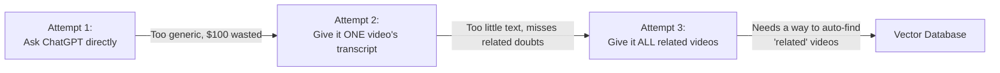

**Attempt 1 — Ask ChatGPT directly.** Forward the student's question straight to ChatGPT. He spent $100 testing this — bad results, because ChatGPT has no idea what's actually taught in his course; it only knows generic internet knowledge. _Like asking a substitute teacher about yesterday's specific lecture — they weren't in the room._

**Attempt 2 — Give it one video's transcript.** Upload the transcript of that exact lesson so ChatGPT can reference it. Money detail: AI models charge based on how much text you _send_ per message, not how much you've _stored_ — so uploading once and referencing it later is cheap. Still not enough, though: one 5-minute video has too little text, and students often ask about things covered in _other, related_ videos that this file doesn't contain.

**Attempt 3 — Give it all related videos.** Gather every related video's transcript, not just one, so the AI has much richer context. This raises the real question: how does the system automatically know which videos are related? That's the job of a **vector database**.

---

## What Is a Vector Database?

Its whole job in one sentence: **given something, find other things similar to it.**

**Real-world example:** A library where books are shelved by _meaning_ instead of alphabetically — similar topics sit physically close together. A vector database does the same thing with text: it converts each transcript into a **point in space** (a "vector" or "embedding"). Similar transcripts end up as nearby points; unrelated ones end up far apart.

### A Simplified Picture

Plotting each video on a graph:

- Left-right = video length
- Up-down = how often "system design" is mentioned
- Color = how often "low level design" is mentioned (blue = high, red = low)

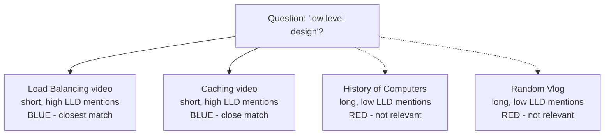

A question about "low level design" would target the bluest points — and among those, shorter videos are preferred, since the topic then makes up a bigger share of that video rather than a passing mention. _Like Netflix finding shows close to your taste on its internal map, rather than recommending randomly._

Real systems track hundreds or thousands of such signals at once — far more than 2-3 — so points actually live in **hundreds of dimensions**. Same idea, just impossible to draw. The database does the closeness math for you.

## Why Neon + pgvector

- Already used **Postgres** — pgvector is an add-on that turns it into a vector database, so no new system to learn.
- Didn't want to self-host — Neon manages that.
- Generous free credits, and good documentation.
- Supports **branching** (version history) — so you can rewind and replay your data's history, not just your code's. To fairly compare Model A vs. Model B later, the underlying data has to be identical at that point, not just the code.

_Like adding a new feature to a car you already own and know how to drive, instead of buying a different vehicle._

## The Full Request Flow

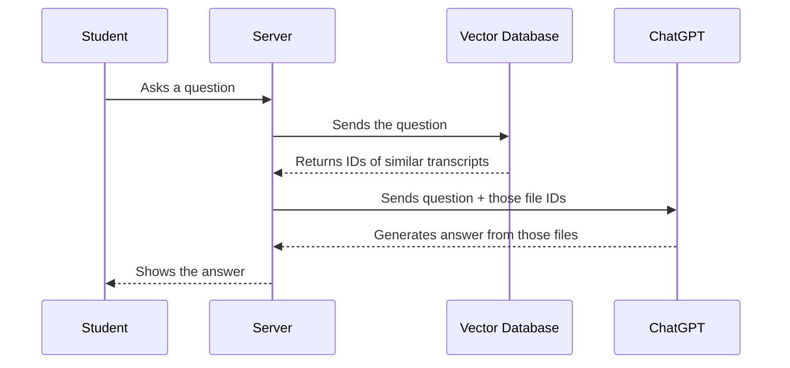

Note what's _not_ sent on every question: not the full transcript text, just the IDs of files already uploaded and stored — keeping it cheap.

_Like a librarian fetching the 3 most relevant books and handing them to a research assistant, who reads only those and writes a summary — instead of trying to recall everything they've ever read._

## Finding Similar Things Fast, Without Checking Everything

With, say, 5,000 stored transcripts, comparing a new question against all of them would be slow. The fix is **clustering**: group similar points together (e.g. 100 per cluster), give each cluster one "representative" point, and compare the new question only against the representatives first (50, not 5,000). Only the winning cluster gets searched in detail.

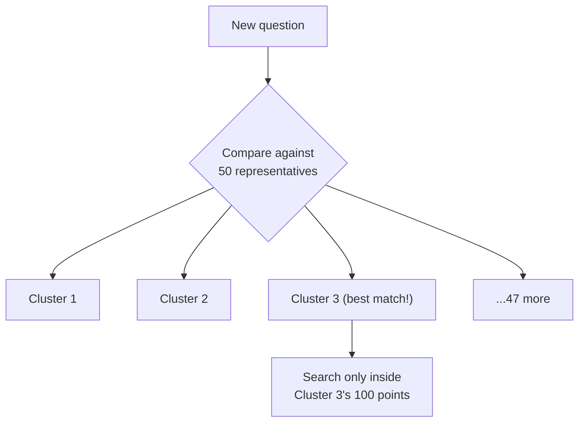

_Like a supermarket: instead of walking every aisle for ketchup, you check the section signs (Produce, Dairy, Condiments) first, then search only within the right one._

> Note: The mechanism described (fixed clusters) + (one representative each) technique called IVF-style clustering.

## Getting Transcripts Into ChatGPT

Each transcript is uploaded to OpenAI via their **Files** API. Once uploaded, it can be referenced by ID whenever needed — no need to resend the full text each time.

## Live Demo: "What Is Load Balancing?"

Three files were automatically selected by the vector database (not hand-picked) as most relevant, then sent to ChatGPT along with the question and a system-design-assistant instruction.

**Answer:** Load balancing spreads incoming traffic across multiple servers so no single one gets overwhelmed, improving availability and reliability.

He's upfront that the answer is simple, not perfect — but instant is better than a 24-hour wait, and an admin can still review and fix/replace AI answers afterward. The AI is a fast first responder, not a replacement for the teacher.

## RAG, Spelled Out

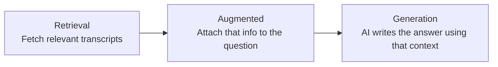

_Like an open-book exam: you're handed the exact pages you're allowed to use (Retrieval), those pages get combined with the question (Augmented), and the answer is written from those specific pages (Generation) — instead of guessing from memory._

---

# Model Context Protocol (MCP): A Deep Dive, Explained Simply

**YouTube video:** https://www.youtube.com/watch?v=uBL0siiliGo
**Channel:** Gaurav Sen (GKCS)

## The Problem MCP Solves

AI models are smart enough to _tell_ you what to do, but they can't actually _do_ it. Their only output is text. That gap — knowing vs. doing — is the whole reason MCP exists.

**Real-world example:** a production outage. Pull the failing requests, replay them locally, find the bug, fix the code, deploy it. Every step here is mechanical — it just needs _access_ (to logs, a runtime, a repo, a deploy pipeline), not human judgment. If a model had that access, it could run the whole fix itself.

## What MCP Actually Is

At its simplest: a **client** (carrying the AI's intelligence) sends a request to a **server** (which exposes tools/APIs), asking it to do something. Client-calls-server is old and boring; what's new is that a _model_ — not a human — is deciding what to call and why.

**Real-world example:** think of the older tool IFTTT ("If This Then That") — useful, but limited to rigid if/else rules a human wrote in advance. An LLM doesn't need those rules; it can look at the actual situation and figure out the right action itself.

### Correction: the LLM doesn't call the tool directly

The video simplifies "client = the LLM," but that's not quite how MCP is actually built. The real architecture has three parts:

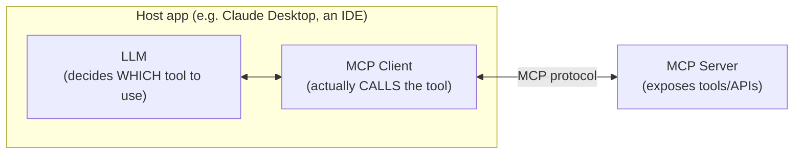

The **Client** is a separate program that fetches the list of available tools from the server and shows them to the model. The model only replies with _which_ tool to use and what inputs to pass — it never calls anything itself. The Client is what actually executes that call. So: **the model chooses, the client executes.**

_(Worth knowing: this pattern is basically a standardized version of "function calling," which some other frameworks — like Microsoft's Semantic Kernel — call "skills." Same underlying idea, different name.)_

### A worked example: checking the weather

Say you ask an MCP-connected assistant: "what's the weather in Bengaluru?"

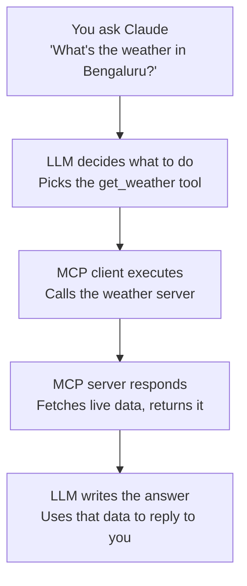

1. **You ask a question.** The host app already knows what tools are available — it got that list from the MCP server ahead of time.
2. **The model decides.** The LLM reads your question and concludes "I need `get_weather`, with `location: Bengaluru`." It only names a tool and its inputs — it never touches a network or API itself.
3. **The MCP client actually makes the call.** This is the separate program sitting between the model and the server. It takes the model's decision and sends the real request to the weather server.
4. **The server does the work.** It hits an actual weather API, gets the current conditions, and sends back a clean, structured result — not raw webpage text. MCP servers is the part of weather.com that actually knows how to fetch the data, by exposing a simple API for the client to call. The model doesn't need to know how to do that; it just needs to know the server exists and what inputs it expects.
5. **The model turns data into an answer.** That structured result goes back to the LLM, which writes a normal sentence like "it's 26°C and partly cloudy in Bengaluru" for you to read.

**Real-world example:** think of the model as a customer at a restaurant, the MCP client as the waiter, and the MCP server as the kitchen. The customer (model) doesn't walk into the kitchen and cook — they tell the waiter what they want. The waiter (client) takes that order to the kitchen (server), the kitchen prepares it, and the waiter brings it back. The customer never touches a stove — they just decide, then eat.

## Use Case 1: Search Engine Optimization → "LMO"

Today, SEO is about Google ranking your page above others for a search. But when an AI model answers the query directly, ranking matters less — what matters is whether **your site is one of the sources the model actually pulls into its answer.**

**Real-world example:** wanting the top 100 coders on Codeforces. A model _could_ scrape the page for this — slow and messy. But if Codeforces exposed a clean API through an MCP server, the model would get a fast, structured answer instantly. The site with the API wins, because the model can actually use it.

This shift is being called **LMO — Language Model Optimization**. The target changes: less "does this look nice to a human," more "is this information complete and structured enough for a model to use." A model doesn't care about page speed or visual design the way a person does.

## Use Case 2: Retrieval Augmented Generation (RAG)

This is why ChatGPT-style tools no longer say "my knowledge stops at some date" — they now go search, fetch fresh sources, and use that to answer.

**The key idea:** RAG decouples how often your _data_ updates from how often the _model_ itself gets retrained.

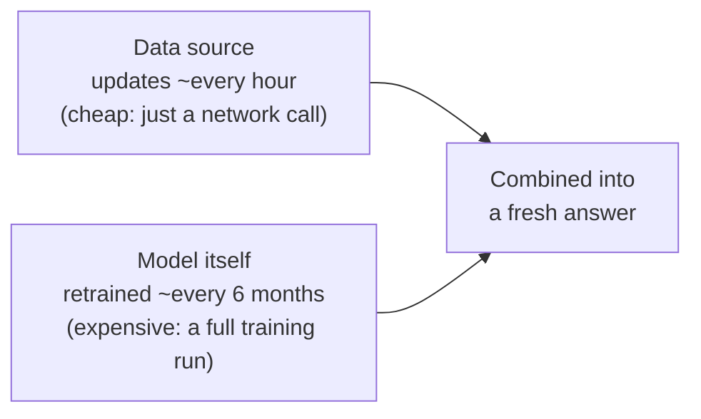

**Real-world example:** think of a textbook (updated every few years, expensive to redo) versus today's newspaper (cheap to print fresh every single day). RAG lets an AI stay "newspaper-fresh" without needing a brand-new "textbook" every time.

MCP improves RAG specifically because the retrieved data now arrives as a clean, structured API response instead of raw HTML the model has to guess its way through.

## The Real Missing Piece: Actions Need Permission Too

MCP lets a model take actions — but only actions it has _access_ to. His example: if ChatGPT doesn't have Gmail access, it can't send an email on your behalf. And even if it did, it clearly shouldn't be allowed to send that email without you saying yes first.

The existing solution for exactly this problem already exists: **OAuth** — the same tech behind "Sign in with Google."

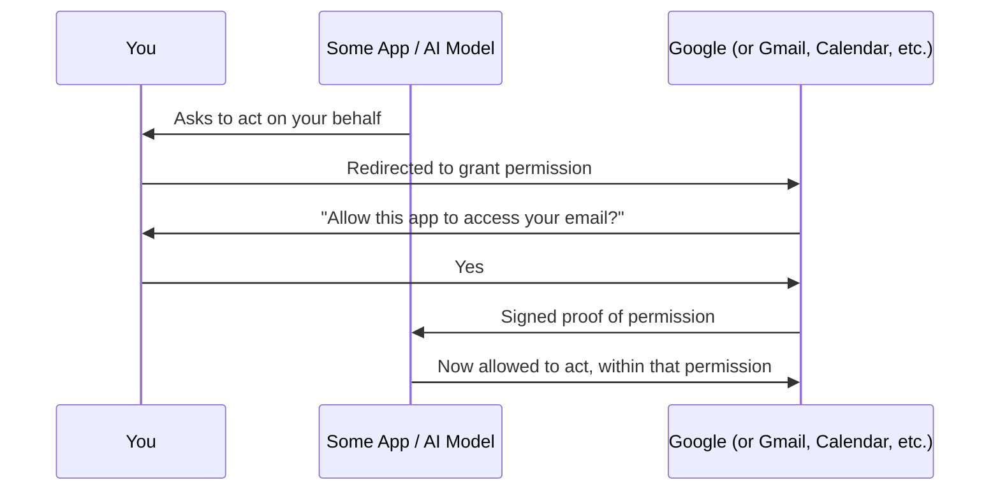

**Real-world example:** it's like handing a valet a special "valet key" that only starts the car and pops the trunk — not one that opens your glovebox or unlocks your house. OAuth lets you hand a model exactly that kind of limited, scoped key: "you can read my calendar" or "you can send this one email," nothing more.

Put OAuth + MCP together and you get his real excitement: an AI with real capability (MCP) _and_ the explicit, scoped permission to actually use it on your behalf (OAuth) — which is what a genuinely useful personal AI agent needs.

---

# AI Agents: Architecture, Use Cases & Future Applications

**YouTube video:** https://www.youtube.com/watch?v=VDhQFBxIgtI
**Channel:** Gaurav Sen (GKCS)

## Why Not Just Write a Script?

Running example throughout the video: a travel agent booking your Mumbai → Bangalore trip. You give it two rough inputs — when you want to go, and roughly where you'll need to work — and it's expected to come back with flights, bookings, hotels, everything.

You _could_ hand-write a script for this. The problem is brittleness: scripts break or need editing for even small changes in requirements, and every change is a manual rewrite. What's different about AI agents is that they can decide which API to call based on the actual situation, instead of following one fixed, pre-coded path.

## Where This Actually Pays Off: Customer Success & Sales

Both are naturally suited because they're **orchestration** — sequences of hand-offs between parties, not single one-shot lookups.

**Real-world example:** a flight refund request. The human process is: ask for details → route to the right department → accept or reject. That's a chain of decisions, and adding intelligence to that chain genuinely improves the experience. Note his framing: the win here is a _smoother_ process, not fewer humans employed — that caveat matters later.

## Five Questions to Ask Before You Build an Agent

These are properties the **problem** should have — not a design checklist for the agent itself.

| #                               | Ask                                      | Why                                                                                                                                                        |
| ------------------------------- | ---------------------------------------- | ---------------------------------------------------------------------------------------------------------------------------------------------------------- |
| 1. Frequency                    | Does this happen often?                  | Hours saved only add up to real ROI if the problem recurs.                                                                                                 |
| 2. Low judgment / low variation | Does it need real case-by-case judgment? | Highly variable, judgment-heavy work (e.g. a _custom_ roadmap per customer) shouldn't be handed over wholesale — the LLM can assist, but shouldn't own it. |
| 3. Low risk                     | How much damage if it's wrong?           | Both directions can hurt — e.g. a refund bot that's _too_ generous costs you money, one that's _too_ strict costs you the customer.                        |
| 4. Low human intervention       | Will a human keep needing to step in?    | Constant bot-then-human hand-offs undercut the whole point and feel clunky.                                                                                |
| 5. Low overall effort           | How complex is the process end-to-end?   | Most real processes eventually need human escalation — pick ones where that's rare, not zero.                                                              |

## How an Agentic Application Is Actually Wired

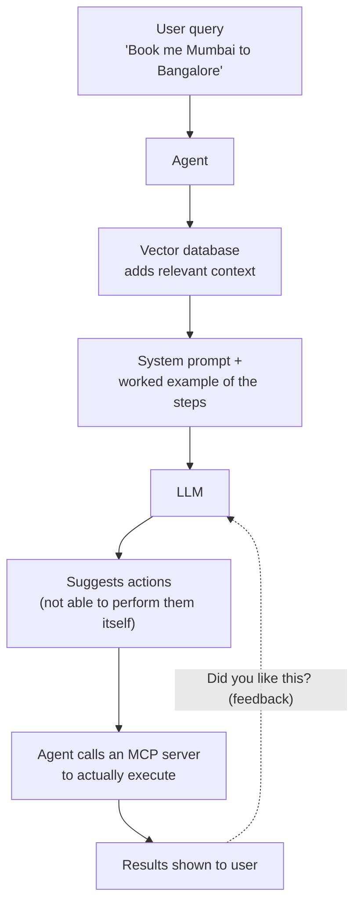

**1. The agent wraps the LLM.** The agent is model-agnostic — could be GPT, Gemini, anything. It's the wrapper holding the whole process together; the LLM is just a component it calls.

**2. Context comes from a vector database first.** A raw question isn't enough on its own. For a travel/commerce agent, useful context includes: what the user's been doing on the site, how many past purchases they've made, what they last bought, and behavioral traits (e.g. do they always look for discounts).

**3. A standing system prompt frames the task — and includes a worked example.** Something like "you are a travel agent managing bookings," plus a **few-shot example** of how to break the task down (e.g. _check flights → check cost → check hotel stay → actually book it_). The example isn't meant to be followed literally — it teaches the model the _pattern_ of decomposition, which measurably improves response quality.

**4. The LLM can only suggest actions — MCP is what executes them.** As of this video, LLMs can't perform actions themselves, only propose them. The agent acts as an **MCP client**, asking an MCP server (e.g. one IndiGo might run for flight bookings) to actually do the booking and payment. Worth being clear-eyed about this: to the user it feels like magic, but underneath it's just calling already-public APIs that the client discovered — the novelty is in the _discovery and orchestration_, not some new capability.

**5. Human feedback closes the loop (RLHF).** If you're happy with the result, that reinforces the behavior; if not — say, the price was too high — the system tries to avoid _all_ the steps it took last time, hoping for a better outcome. The real weakness here: the model can't tell _which specific step_ caused the problem. The signal is just "customer unhappy," so it throws out the whole trajectory rather than isolating the one bad decision (in this case, price).

## Why He Thinks "Agent" Is Currently a Marketing Gimmick

Three specific complaints, stated as opinion rather than fact:

**1. They don't act on their own initiative.** They only run when told to — someone still has to trigger the script. He compares this to a cron job or a workflow file, not a truly independent actor. The bar he's implying for the word "agent": deciding _when_ to act, not just _how_.

**2. They don't really learn — they just avoid.** His sharpest image: it's like scalding your hand on a pan — you flinch and avoid that pan forever, even if everything you did _before_ touching it was fine. The system discards the whole trajectory instead of isolating the one bad step. His conclusion: the algorithms behind these agents are simple, so the agents are, in his word, "dumb" — reactive like reptiles, not genuinely reasoning.

**3. They can't infer the obvious next step.** After booking a flight, downloading the ticket would clearly help — but should you really have to ask for that separately? Current agents can't reliably derive the unstated, obvious follow-up from context the way a competent human assistant would.

## Added context: this matches an existing, more formal distinction

His "cron job vs. real agent" complaint lines up almost exactly with a distinction Anthropic had already published a few months before this video, in their "Building Effective Agents" post:

- **Workflows** — LLMs and tools orchestrated through a **predefined code path** you wrote in advance.
- **Agents** — the LLM **dynamically directs its own process** and tool use, deciding the path itself as it goes.
  By that definition, most of what gets marketed as an "AI agent" today — including the travel-booking example in this video — is closer to a workflow with an LLM step bolted on, which is exactly his point. It's a useful, more precise vocabulary for the same critique, not a correction of anything he got wrong.

---

# The Latest LLM Research: How Models Are Getting Smarter and Faster

**YouTube video:** https://www.youtube.com/watch?v=_Y3BfN9v3sA
**Channel:** Gaurav Sen (GKCS)

## Two Competing Ways to Make a Model Smarter

The video sets up a tension: models are getting **smaller and smarter at the same time**, not trading one off for the other. That happens because of two different "scaling laws" — more parameters, vs. more compute spent thinking per training example — plus a set of engineering tricks that fund the second one.

## Scaling Law 1: Bigger Models Are Smarter

"Bigger" means more parameters — more neurons, more connections, more weights. His comparison: a 405-billion-parameter model vs. a 3-billion-parameter one — the bigger one wins, because it has far more "room" to represent a complicated question.

**Real-world example:** think of it like a jigsaw puzzle. A 10-piece puzzle can only ever show a simple picture. A 10,000-piece puzzle can represent something intricate and detailed. More parameters = more pieces available to represent a complex idea.

The catch: training something with a trillion parameters is brutally expensive, because _every_ input has to pass through _every_ parameter, in both directions (forward pass and backpropagation). That cost is what the rest of the video tries to buy back down.

## Shrinking the Weights: "1.58-bit" Models (Process is called "quantization")

The first fix: store each weight with far less precision. One bit per weight (just 1 or 0) doesn't work — too much accuracy is lost. But a **three-state** scheme — each weight is -1, 0, or +1 — works surprisingly well, keeping most of the model's intelligence while making it dramatically cheaper to store and compute with.

**Real-world example:** it's the difference between a plain light switch (2 states: on/off) and a traffic light (3 states: stop, caution, go). You don't need infinite precision to know whether to _lean into_ a weight, _ignore_ it, or _lean against_ it — three signals is enough, and that's exactly what -1/0/+1 encodes.

### Correction: this is usually called "1.58-bit," not "two-bit"

The video describes this as a two-bit scheme. The actual, more precise name for it (and the name used in the real research) is **1.58-bit** — because with exactly 3 possible states per weight, the true information content is log₂(3) ≈ **1.58 bits**, not a full 2 bits.

## Avoiding the Fetch: GPU Cache and FlashAttention

The second fix is about _movement_, not size: avoid repeatedly fetching weights from slower memory. The named technique is **FlashAttention** — it uses the GPU's fast on-chip memory (SRAM) more cleverly, so computation happens where the data already is, instead of constantly shuttling it back and forth.

FlashAttention's trick: instead of constantly running back to the slow memory, it loads a small chunk of data into the fast memory once, does as much of the math as it can while it's sitting right there, and only sends the finished result back out at the end. Same exact answer — just far fewer trips.

**Real-world example:** a chef who keeps today's most-used ingredients right on the counter, instead of walking to the pantry for every single one — the meal comes out faster purely because of less walking around, not because the ingredients changed.

**Together, these two ideas (smaller weights + smarter caching) don't just make training faster — the saved time becomes a budget to spend elsewhere.** That's the pivot the rest of the video is built on.

## Spending the Saved Time: Test-Time Compute

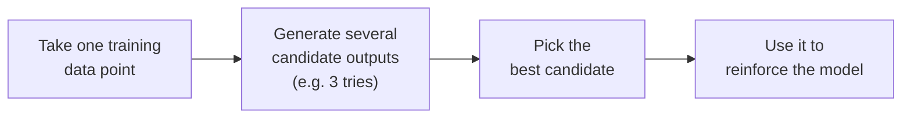

Instead of asking the model for one answer per training example, ask it for several, then pick the best one and use _that_ as the training signal. The number of data points doesn't change — what changes is how much thinking happens per data point.

**Real-world example:** a writer who drafts three versions of a tricky paragraph and picks the best one, instead of writing a single draft and going with whatever comes out first.

## The Headline Result: A Tiny Model Beating a Giant One

Using this approach, a **1-billion-parameter** Llama model outperformed a **405-billion-parameter** Llama model. The small model didn't see more data, it just **thought harder about each data point** during training (multiple candidates generated, best one kept).

### A more precise picture of this result

A couple of things worth being exact about, since the headline claim slightly overstates the paper's finding:

### The circularity — and why it resolves

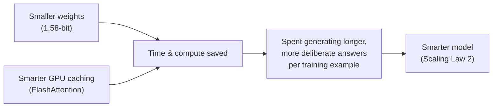

Generating multiple candidates per data point takes time — and that time has to come from somewhere. It comes from the savings made by shrinking the weights and using the cache well. Quantization and FlashAttention make the model smaller and faster, which frees up time to spend on generating multiple candidates per training example, which makes the model smarter.

---

# AI Engineering #1: Attention Is All You Need — Explained Simply

**YouTube video:** https://www.youtube.com/watch?v=jPGaYb853GM
**Channel:** Gaurav Sen (GKCS)

## The Core Problem: Words Can Be Ambiguous

Take the sentence: **"I went to the bank \_\_\_"**

"Bank" could mean a financial institution, a river bank, a blood bank — you genuinely can't tell which from those words alone. The whole class rests on one idea: a model can only generate a good continuation if it understands what the input means, and the only way to resolve an ambiguous word is by looking at the _other_ words around it.

## Step 1: Turning Words Into Numbers — The Feature Table

Before comparing words, you have to describe them. Each word gets scored (0 to 1) on a set of hand-picked characteristics:

| Characteristic         | I   | went¹ | to  | the | bank  | deposit |
| ---------------------- | --- | ----- | --- | --- | ----- | ------- |
| place                  | 0   | 0     | 0.9 | 0   | **1** | 0       |
| finance                | 0   | 0.2   | 0   | 0   | **1** | **1**   |
| person                 | 1   | –     | –   | –   | 0     | 0       |
| computer / computation | 0.5 | 0     | 0   | –   | 0.5   | 0       |
| river                  | 0   | 0     | 0   | –   | **1** | 0       |
| blood                  | –   | –     | –   | –   | 0.5   | 0       |
| storage                | –   | –     | –   | –   | 0.9   | –       |

_¹The video's own table actually reasons about the word "want" here (as in "I want some money," which is where the 0.2 finance score comes from) — but the sentence's real second word is "went." A viewer comment flagged this. The mechanics being taught aren't affected, just that one column's justification._

**Reading a column top-to-bottom gives you that word's numeric fingerprint.** Read "bank's" column: it scores high on _place_ (1), _finance_ (1), and _river_ (1), plus _blood_ (0.5) and _storage_ (0.9) — a word that, taken alone, is genuinely pulled in several directions at once. That's the table's whole point: describe every word as thoroughly as possible, and the ambiguous ones will show it by having several high scores instead of one.

**Real-world example:** it's like a job-matching profile. Instead of one label, a candidate gets scored across many separate traits — technical skill, leadership, communication — and it's the _combination_ of scores that makes the profile useful, not any single number.

## Step 2: The Attention Matrix — Measuring How Related Words Are

Line every word up as both rows and columns (5 words → a 5×5 grid). Each cell = the dot product of the row word's and column word's fingerprints from the table above (multiply matching characteristics, add them up).

For the plain sentence, "bank's" row looks like this:

| bank vs. | I   | went | to  | the | bank  |
| -------- | --- | ---- | --- | --- | ----- |
| relation | 0   | 0    | 0   | 0   | **1** |

All zero except against itself. That's the model discovering exactly what a human would: nothing here disambiguates "bank" — same as reading the sentence yourself and shrugging.

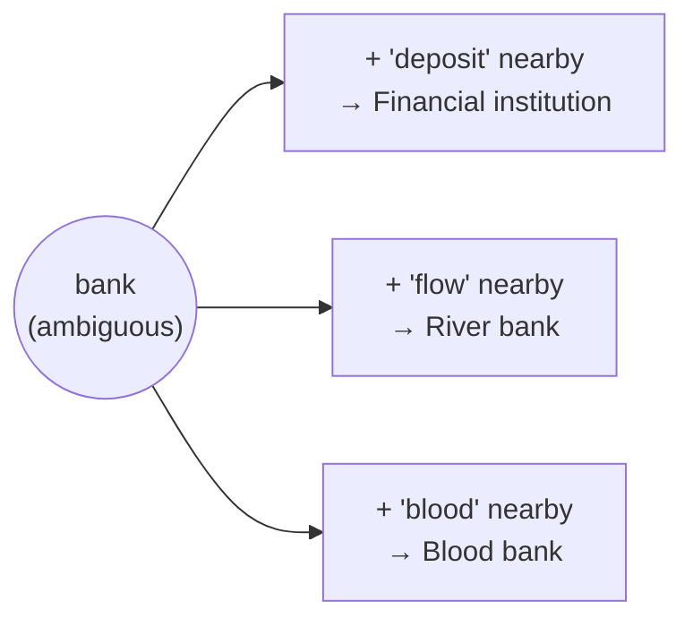

## Step 3: Add Context — "I went to the bank to make a deposit"

Extend the sentence, and "bank's" row picks up a new, non-zero relation:

| bank vs. | to  | make | a   | deposit |
| -------- | --- | ---- | --- | ------- |
| relation | 0   | 0    | 0   | **0.5** |

Where does 0.5 come from? Looking at the table in Step 1, "bank" and "deposit" both score **1** on _finance_ — every other row multiplies out to zero (deposit is 0 on place, person, computer, river, and blood). So the _only_ thing driving the relation is that shared finance score. _(Strictly multiplying the table values out gives 1×1 = 1 here, not 0.5 — this is one of a few spots where the video's live arithmetic doesn't perfectly match its own table; the underlying idea, that finance is the sole contributing row, still holds.)_

That single non-zero relation is what tells the model: **this "bank" is the financial kind.** Change the ending instead to "...today to donate **blood**," and it's the _blood_ and _storage_ rows that light up, pulling "bank" toward the blood-bank meaning instead. Change it to "...**today**" with nothing else added, and there's no pull at all — the ambiguity survives, because "today" has no relation to "bank" on any row.

## The Result: Static Meaning → Contextual Meaning

The output isn't a new word — it's the original nudged in a direction:

- Financial reading: **bank + 0.5 × deposit**
- Blood-bank reading: **bank + 0.3 × blood**

Same starting word, different context, different final meaning — and that shifted vector is what actually gets handed to the model to generate a response. This generalizes everywhere: "apple" (fruit vs. company), "crane" (bird vs. machine), or in Hindi, "goli" (a bullet vs. a medicine tablet) — same mechanism, resolved by whatever words happen to be nearby.

---
